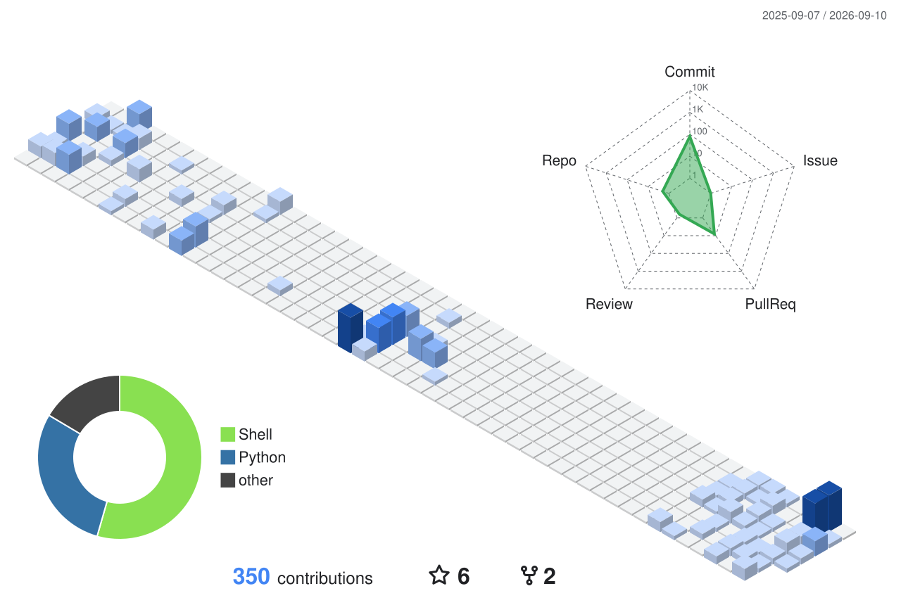
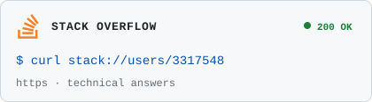

  <h1>Baichuan Sun, Ph.D.</h1>
  
<b>Lead GenAI Engineer @ Google APAC</b>

  
<i>Bridging Deep R&D, Corporate Strategy, and Production-Grade Engineering</i>

  

    
    
    
    
    
  

---

### 🌐 The Convergence of Intelligence & Strategy
I architect the bridge between **scientific rigor** and **sustainable business value**. My work centers on translating the kinetic energy of frontier AI research into the potential energy of enterprise transformation. From computational physics to boardroom decision-making and hyperscale cloud AI engineering, I navigate the full stack of modern intelligence.

---

### 🚀 Current Focus: Frontier GenAI & Reasoning
At Google, I advise APAC’s enterprise C-suites on the sovereign adoption of Generative AI, focusing on:

*   **Agentic Data Engines:** Moving beyond simple RAG into autonomous, multi-modal reasoning loops.
*   **Infrastructure Economics:** Optimizing elastic HPC and training/inference costs for the next billion tokens.
*   **Cognitive Trust:** Engineering the guardrails, red-teaming frameworks, and safety layers required for enterprise-grade compliance.
*   **Next-Gen CX:** Deploying hyper-personalized, real-time multimodal agents that redefine human-computer interaction.

---

### 🏗️ Strategic Engineering & Selected Research
*Bridging the gap between frontier research and production-grade systems.*

<table border="0">
<tr>
<td width="50%" valign="top">
<h4>🧠 Reasoning AI (GRPO)</h4>

Architected distributed <b>NeMo-RL</b> clusters on GKE to fine-tune <b>Gemma 3</b> using Group Relative Policy Optimization (GRPO). Optimized FSDP sharding on <b>NVIDIA B200</b> clusters.

<i>Value: Achieved +6.2% absolute gain in MATH-500 accuracy via custom reward engineering.</i>

</td>
<td width="50%" valign="top">
<h4>🔍 Enterprise Document AI (OCR)</h4>

Architected a multi-modal <b>Financial Audit engine</b> using LMMs and advanced OCR. Automated the extraction of complex, unstructured data from heterogeneous financial instruments.

<i>Value: Eliminated 90% of manual data entry for Tier-1 financial institutions.</i>

</td>
</tr>
<tr>
<td width="50%" valign="top">
<h4>🤖 Spatial Intelligence & Robotics</h4>

Developed high-fidelity <b>Computer Vision</b> pipelines for autonomous robotic systems. Focused on real-time object detection and kinematic path planning in dynamic environments.

<i>Value: Reduced manual oversight by 40% in industrial automation.</i>

</td>
<td width="50%" valign="top">
<h4>⏳ Predictive Prognostics</h4>

Leveraging my background in <b>Thermodynamics</b>, I built <b>Time Series Forecasting</b> models for high-value industrial assets to predict failure modes before they occur.

<i>Value: Saved millions in unplanned downtime for energy providers.</i>

</td>
</tr>
</table>

---

### 🛠️ Technical Ecosystem

| **Frontier GenAI & Research** | **Scalable Engineering & HPC** | **Strategy & Domain** |
| :--- | :--- | :--- |
| `Gemini / Gemma 3` | `NVIDIA B200` | `C-Suite Advisory & Consulting` |
| `GRPO & RLHF (NeMo-RL)` | `Ray on GKE (KubeRay)` | `Unit Economics of AI` |
| `Vertex AI & Model Garden` | `PyTorch FSDP & DCP` | `AI ROI & TCO Modeling` |
| `Agentic RAG / Agents` | `vLLM & FlashInfer` | `Sovereign AI Frameworks` |
| `Dynamic Grounding` | `Distributed Training (XLA)` | `Gov & Risk Management` |

---

### 📈 Global Impact & Thought Leadership
> "Science is only as useful as its ability to be democratized."

*   **Lead GenAI Solutions:** Architecting AI roadmaps for APAC Decacorns, transforming legacy data into **Agentic Intelligence**.
*   **Open Source Authority:** Co-author and [PyPI maintainer](https://pypi.org/project/amazon-denseclus/) of [Amazon DenseClus](https://github.com/awslabs/amazon-denseclus), an AWS Labs package for mixed-type clustering with [138K+ downloads](https://pepy.tech/projects/amazon-denseclus).
*   **3M+ Professionals reached** via technical publications and strategic guidance on AI infrastructure and economics.
*   **Global Footprint:** Mechanical Engineering (🇨🇳) → Robotics Researcher at Tohoku (🇯🇵) → Statistical Physics PhD at NTU (🇸🇬) → Wolfram Summer School (🇺🇸) → CSIRO/McKinsey/AWS (🇦🇺) → Google.

---

### 🧬 Contribution Topology

  

---

### 🚀 Strategic Open Source Ecosystem
*Active contributor to the foundational frameworks defining the future of AI/ML.*

  
  
  
  
  
  

---

### 📡 External Interfaces

    
  
  
   
  
  

---

